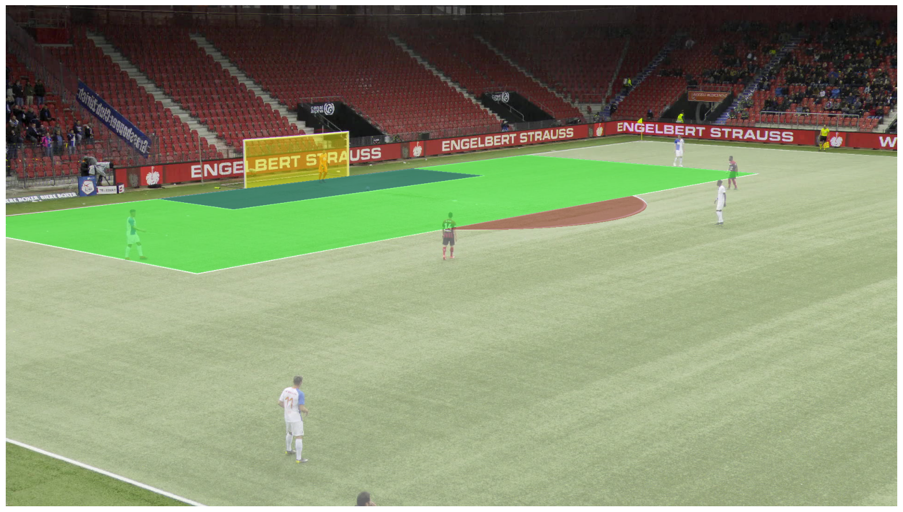
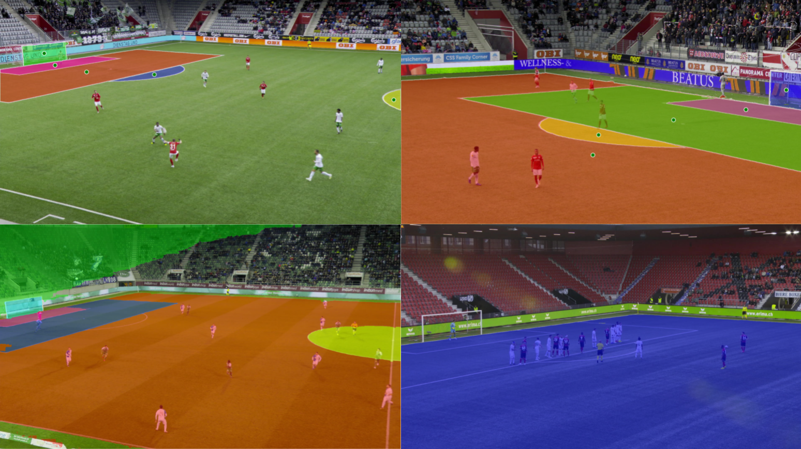

# Sports Field Recognition

This repository provides code for sports field recognition using Segment Anything 2 (SAM2) and YOLO. It is built around the SoccerNet-GSR dataset which includes pitch-annotated video sequences of 30 seconds.

## Resources

- **Dataset:**
  - [SoccerNet-GSR](https://github.com/SoccerNet/sn-gamestate)
- **Models required:**
  - [Segment Anything 2 (SAM2)](https://github.com/facebookresearch/sam2)
  - [YOLO (Ultralytics)](https://github.com/ultralytics/ultralytics)

## Content

1. **Mask Generation from Labeled Points**  
   

   - Code for mask generation can be found in the [`mask_generation`](mask_generation/) folder. Generates a ground-truth segmentation mask of the field based on labeled points.

2. **Training, Evaluation, and Visualization**  
   
   - SAM2 and YOLO-based field segmentation and detection. Scripts to [`train`](training/) models, [`evaluate`](evaluation/) performance, and visualize predictions.
